# Time-Series Anomaly Detection (TSAD) Flask Application

## Introduction
This Flask application implements the algorithms and methodologies from the "Unsupervised Model Selection For Time-series Anomaly Detection" paper. The platform provides an interactive interface to apply various anomaly detection models to time-series data, enabling unsupervised model selection in an intuitive manner.


## Project Structure
The project is organized into several directories and files, each serving a specific purpose within the application:
- `algorithm/`: Implements the core anomaly detection algorithms.
- `configs/`: Contains configuration files for application settings and model parameters.
- `controller/`: Flask controllers that manage the routing of web requests.
- `dao/`: Data Access Object (DAO) for database interactions.
- `datasets/`: Utilities for loading the datasets.
- `evaluation/`: Utilities for evaluating model performance.
- `model_selection/`: Implements the model selection algorithm described in the paper.
- `models/`: Defines the machine learning models.
- `services/`: Contains the business logic layer of the application.
- `static/`: Holds static files like CSS, JavaScript, and images.
- `templates/`: Stores the HTML templates for the web interface.
- `utils/`: Helper functions and utilities.
- `app.py`: The Flask application's main entry point.

## Getting Started

### Prerequisites
- [Conda](https://docs.conda.io/en/latest/)

### Installation
Follow these instructions to get the application up and running:

1. Clone the repository:
   ```bash
   git clone [your-repo-url]
   cd [project-directory]
   conda create --name tsad python=3.8
   conda activate tsad
   pip install -r requirements.txt
   python app.py
After running the application, visit `http://localhost:5012` in your web browser to use the application.

## Enhancements and Customization
Details on enhancements or modifications to the original code are documented here.

## Adding New Algorithms from PyOD Library
The application is integrated with the PyOD library, allowing users to add anomaly detection algorithms directly through the user interface.

### Steps to Add an Algorithm from PyOD:
1. Navigate to the "New Model Name" dropdown menu on the application's interface.
2. Select the desired algorithm from the PyOD library listed in the dropdown.
3. Click "Add Model" to include the selected algorithm in the application's model suite.

This feature streamlines the process of extending the application's capabilities with a wide range of specialized anomaly detection models provided by the PyOD library.


## Adding New Algorithms
Contributors can add new algorithms by:
1. Creating a new class in the `algorithm/` directory that inherits from `base_model.py`.
2. Implementing the training function within `model_trainer/train.py`. 
```python
# Replace [algorithm] with your actual algorithm name

def train_[algorithm]:
   MODEL_ID = 0
   model_hyper_param_configurations = list(ParameterGrid(PYOD_PARAM_GRID))
   train_hyper_param_configurations = list(
       ParameterGrid(PYOD_TRAIN_PARAM_GRID))
   for train_hyper_params in tqdm(train_hyper_param_configurations):
       for model_hyper_params in tqdm(model_hyper_param_configurations):
           model = [algorithm](**model_hyper_params)

       if not self.overwrite:
           if self.logging_obj.check_file_exists(
                   obj_class=self.logging_hierarchy,
                   obj_name=f"[algorithm]{MODEL_ID + 1}"):
               print(f'Model [algorithm]{MODEL_ID + 1} already trained!')
               continue

       self.train('[algorithm]', model, model_hyper_params, train_hyper_params, MODEL_ID)
       MODEL_ID = MODEL_ID + 1
```
3. Update the database `db/tsad.db` with the new algorithm identifier.
4. For database interaction and management, [DB Browser for SQLite](https://sqlitebrowser.org/) is used. It is an open-source tool to create, design, and edit database files compatible with SQLite.


## Adding New Datasets
To add new datasets:
1. Input the new dataset folder path in the "Datasets Location" section of the web interface.
2. Click "Update Config" to save the new path.
3. Add CSV-formatted dataset folder to the newly specified directory.

## Authors and Acknowledgment
Credit is given to the original paper authors and contributors to this application.

## References
- Goswami, M., Challu, C., Callot, L., Minorics, L., & Kan, A. (2023). Unsupervised Model Selection For Time-series Anomaly Detection. *Journal of Time Series Analysis*, 44(3), 555-567. doi:10.1111/jtsa.12456. Available at: [https://arxiv.org/abs/2210.01078](https://arxiv.org/abs/2210.01078).
- Challu, C., Olivares, K. G., Oreshkin, B. N., Garza, F., Mergenthaler-Canseco, M., & Dubrawski, A. (2022). N-HiTS: Neural Hierarchical Interpolation for Time Series Forecasting. arXiv:2201.12886v6 [cs.LG]. Available at [https://arxiv.org/abs/2201.12886](https://arxiv.org/abs/2201.12886).


   


